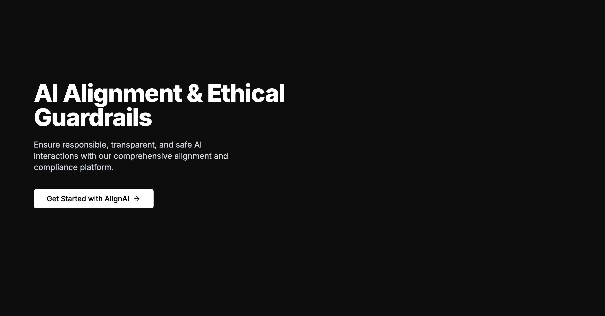
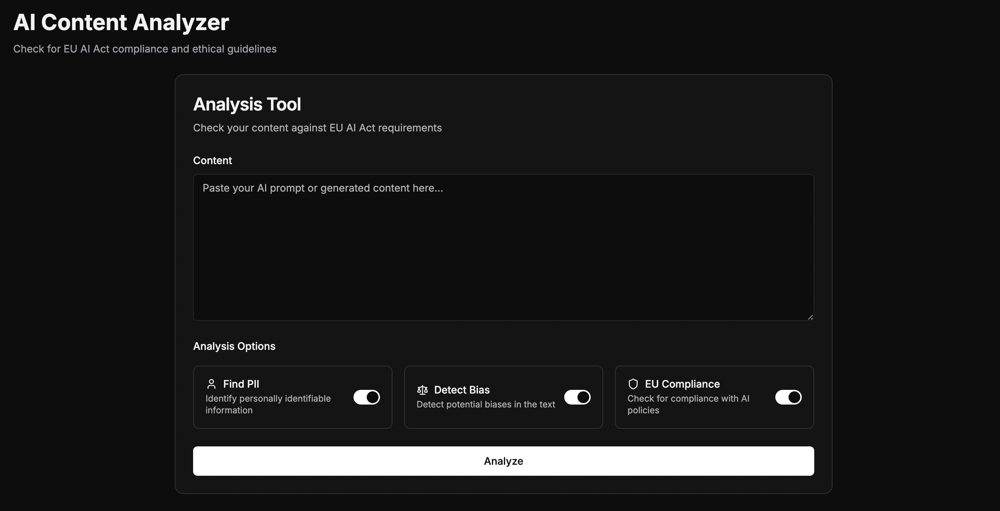
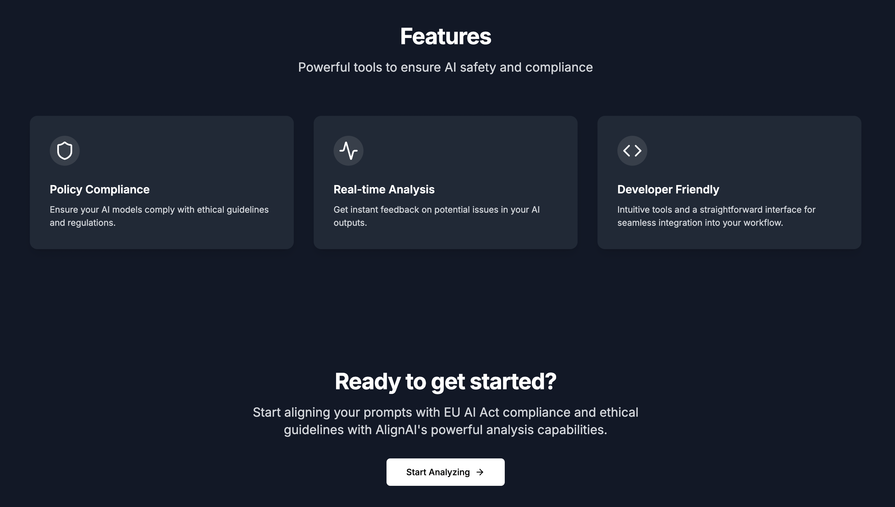

# AlignAI: AI Alignment & Compliance Analysis



AlignAI is a specialized tool designed to help developers and organizations evaluate AI-generated content against key ethical and regulatory standards. By analyzing text for potential issues across multiple dimensions, AlignAI provides actionable insights to improve AI system safety and compliance.



## Core Capabilities



- **Multi-Dimensional Analysis**: Comprehensive examination of prompts across three critical dimensions: bias detection, PII identification, and policy compliance
- **Risk Assessment**: Dynamic risk scoring system that quantifies concerns with confidence levels to prioritize remediation efforts
- **Policy Compliance Verification**: Mapping of input text against relevant EU AI Act regulations with specific article references
- **Visual Risk Indicators**: Color-coded indicators and percentage scores to quickly identify areas of concern
- **Detailed Explanations**: Context-specific explanations of detected issues to facilitate understanding and correction

- **Multi-Dimensional Analysis**: Comprehensive examination of prompts across three critical dimensions: bias detection, PII identification, and policy compliance
- **Risk Assessment**: Dynamic risk scoring system that quantifies concerns with confidence levels to prioritize remediation efforts
- **Policy Compliance Verification**: Mapping of input text against relevant EU AI Act regulations with specific article references
- **Visual Risk Indicators**: Color-coded indicators and percentage scores to quickly identify areas of concern
- **Detailed Explanations**: Context-specific explanations of detected issues to facilitate understanding and correction

## Model Training & Alignment Approach

### Bias Detection Model

The bias detection model was fine-tuned on a carefully curated dataset containing:
- Balanced examples of biased and unbiased text across multiple domains and contexts
- Annotations for various bias types (gender, racial, age, socioeconomic, etc.)
- Confidence scoring to reflect the certainty of bias detection

Training approach:
- Base model: RoBERTa architecture with classification head
- Fine-tuning method: Supervised learning with bias/non-bias labels
- Validation method: Cross-validation with human review of edge cases

### PII Detection System

Built using a hybrid approach combining:
- Pattern matching with regular expressions for structured PII (emails, phone numbers, etc.)
- Named entity recognition for identifying names, locations, and organizations
- Contextual analysis to reduce false positives

Training data includes diverse examples of personal information formatted in various ways, with special attention to indirect identifiers that could lead to re-identification.

### Policy Compliance Engine

- Trained on the full text of the EU AI Act, broken down into semantic units
- Vectorized using sentence transformers to enable semantic similarity matching
- Includes mechanisms to map detected issues to specific articles and clauses

## Technical Architecture

- **Frontend**: Next.js with React for a responsive, modern user interface
- **Backend**: FastAPI for efficient, type-safe API endpoints
- **Model Deployment**: Optimized inference pipeline for rapid analysis
- **Inter-component Communication**: JSON-based API for flexibility and extensibility

## Getting Started

### Prerequisites

- Node.js 18+ and npm
- Python 3.9+

### Installation

```bash
# Clone the repository
git clone https://github.com/your-username/alignai.git
cd alignai

# Install frontend dependencies
cd frontend && npm install

# Install backend dependencies
cd ../backend && pip install -r requirements.txt
```

### Running the Application

```bash
# Start the frontend (from the frontend directory)
npm run dev

# Start the backend (from the backend directory)
python -m uvicorn main:app --reload --port 8000
```

Visit `http://localhost:3000` to access the frontend application.

## Project Structure

AlignAI is organized into several key components:

### Backend

- `backend/api/` - FastAPI routes and endpoints
- `backend/core/` - Core analysis models and logic
  - `bias_detection/` - Bias identification models
  - `pii_detection/` - Personal data detection systems
  - `policy_detection/` - EU AI Act compliance verification
- `backend/models/` - Data models and schemas
- `backend/utils/` - Helper functions and utilities

### Frontend

- `frontend/src/components/` - React components
  - `analyzer/` - Text analysis interface components
  - `ui/` - Shared UI elements and design system
- `frontend/src/lib/` - Frontend utilities and API client
- `frontend/src/app/` - Next.js application pages

### Model Training

- `models/bias_detection/` - Training scripts and data for bias models
- `models/pii_detection/` - Training scripts for PII detection
- `models/policy_detection/` - EU AI Act policy text processing

## Implementation Status

AlignAI currently implements:

- Text analysis capabilities across three dimensions (bias, PII, policy compliance)
- Backend endpoints for processing prompts and generating analysis
- Frontend interface for submitting text and viewing analysis results
- Color-coded risk indicators and detailed explanations
- Model deployment and integration pipeline

## Future Enhancements

- Expanded model training with additional data sources
- User authentication and project management
- Batch analysis capabilities for multiple prompts
- Extended explanations with mitigation suggestions
- Additional policy frameworks beyond EU AI Act
